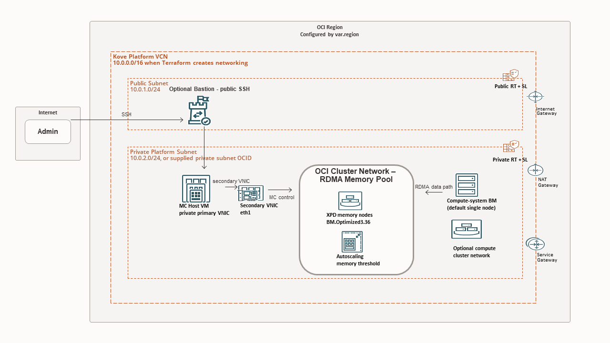

# oci-kove-terraform

Terraform configuration for deploying a Kove RDMA shared-memory platform on Oracle Cloud Infrastructure (OCI).

[](https://cloud.oracle.com/resourcemanager/stacks/create?zipUrl=https://github.com/oci-fsi-pursuits/oci-kove-terraform/archive/refs/heads/main.zip)



## What This Deploys

The root module can deploy:

- OCI networking, or use existing public/private subnets
- one MC instance, which is the management VM
- RDMA memory-node bare metal infrastructure
- one optional `compute-system` bare metal node, enabled by default
- one optional bastion jump host, enabled by default

The MC instance is the management VM. There is no second management VM in `xpd-cluster`.

## Image Inputs

Use one shared RHEL 8.10 base image by default, then override only where needed:

```hcl
rhel8_10_image_ocid        = "ocid1.image.oc1..REPLACE_ME"
bm_node_custom_image_ocid  = ""
mc_custom_image_ocid       = ""
bastion_custom_image_ocid  = ""
```

Image precedence:

- RDMA memory nodes and `compute-system` use `bm_node_custom_image_ocid` when set; otherwise `rhel8_10_image_ocid`.
- MC/management uses `mc_custom_image_ocid` when set; otherwise `rhel8_10_image_ocid`.
- Bastion uses `bastion_custom_image_ocid` when set; otherwise `rhel8_10_image_ocid`.

## Main Components

| Component | Module | Default | Purpose |
|---|---|---:|---|
| MC/management | `modules/mc-instance` | enabled | Runs the MC host and management workflow. |
| RDMA memory nodes | `modules/xpd-cluster` | enabled | Creates the RDMA memory-node OCI cluster network. |
| Compute-system BM | `modules/compute-system` | enabled | Optional compute-system deployment as either a single BM (default) or a dedicated cluster network + instance pool. |
| Bastion | `modules/bastion` | enabled | Optional public jump host. |

To skip the optional compute-system node while keeping memory nodes:

```hcl
enable_compute_system = false
```

To keep the compute-system module enabled but switch it to dedicated compute-system cluster-network mode (instance-pool based):

```hcl
compute_system_use_cluster_network       = true
compute_system_cluster_network_node_count = 1
```

This toggle defaults to `false` (single-instance remains the default behavior). A compute-system cluster network does not require autoscaling. To enable **CPU-based** autoscaling for the compute-system cluster network, add:

```hcl
compute_system_cluster_network_enable_autoscaling                       = true
compute_system_cluster_network_autoscaling_min_nodes                    = 1
compute_system_cluster_network_autoscaling_max_nodes                    = 4
compute_system_cluster_network_autoscaling_initial_nodes                = 1
compute_system_cluster_network_autoscaling_cooldown_seconds             = 300
compute_system_cluster_network_autoscaling_scale_out_threshold_percent  = 75
compute_system_cluster_network_autoscaling_scale_in_threshold_percent   = 30
compute_system_cluster_network_autoscaling_scale_out_by                 = 1
compute_system_cluster_network_autoscaling_scale_in_by                  = 1
```

To skip the bastion:

```hcl
enable_bastion = false
```

## Naming And Tags

Default display names use `defined_tag_namespace` and `kove_environment`. With:

```hcl
defined_tag_namespace = "kove"
kove_environment      = "prod"
```

RDMA memory nodes are named `kove-prod-xpd-1`, `kove-prod-xpd-2`, and so on. Compute-system nodes use `kove-prod-compute-1`, `kove-prod-compute-2`, and so on when deployed through an instance pool.

Resources use OCI defined tags, not freeform tags. Set `defined_tag_namespace` to the existing OCI tag namespace that contains the standard tag keys. That same value is also used as the default naming namespace, so operators only need to set it once:

```hcl
enable_defined_tags   = false
defined_tag_namespace = "kove"
```

Defined tags are now disabled by default. Set `enable_defined_tags = true` after the OCI tag namespace and keys exist.

## RDMA Deployment Mode

This repository is documented for the production `cluster_network` flow.

- `cluster_network`: creates an OCI cluster network for the RDMA memory-node pool.
- The optional `compute-system` deployment defaults to a standalone BM in the private subnet, and can be switched to its own cluster-network + instance-pool mode.

## Cluster Placement Group (xpd-cluster)

Placement group controls are part of the RDMA/xpd path (`modules/xpd-cluster`) and are configured from root tfvars.

```hcl
cluster_placement_group_enabled     = true
cluster_placement_group_type        = "STANDARD"
cluster_placement_group_name        = "kove-rdma-cpg"
cluster_placement_group_description = "RDMA bare metal placement group"
```

If omitted, defaults apply and placement groups are not created.

> ⚠️ Capacity warning
> Cluster placement groups can reduce placement flexibility. In constrained AD/FD capacity conditions, enabling them may increase launch delays or capacity-related provisioning failures.

## Start Here

1. Create the OCI defined-tag namespace and keys before running `terraform apply`.

Terraform applies standard defined tags to OCI resources. In OCI Console, go to **Governance & Administration** -> **Tag Namespaces**, create or reuse the `kove` namespace, then create these tag keys:

- `project`
- `environment`
- `managed_by`
- `workload`
- `node_role`
- `node_pool`
- `node_index`
- `cluster_name`

Your `.tfvars` should point Terraform at that namespace:

```hcl
enable_defined_tags   = false
defined_tag_namespace = "kove"
```

If the namespace or keys do not exist and `enable_defined_tags = true`, OCI will reject the deployment with an `Invalid tags` error.

2. Download the required Kove documentation and software files from [download.kove.com/login](https://download.kove.com/login). Treat these as prerequisites for the deployment and MC completion workflow:

- `Kove_Direct_System_Architecture-C_API-2503`
- `Kove_SDM-Getting_Started-2503`
- `Kove_SDM-Interoperability_Matrix-2503`
- `Kove-Compute_System_Software-User_Guide-2503`
- `Kove-Management_Console-User_Guide-2503`
- `Kove-XPD_Memory_Target_Software-User_Guide-2503`
- `kove-xpd-software-2503-rhel8.10`
- `kove-mc-2503-mcvirt`
- `kove-compute-software-2503-rhel8.10`

3. Copy the example variables file:

```bash
cp terraform.tfvars.example terraform.tfvars
```

4. Edit `terraform.tfvars` for your tenancy, compartment, subnets, RHEL 8.10 image, and deployment mode.

5. Initialize and deploy:

```bash
terraform init
terraform plan
terraform apply
```

6. Post-deployment setup begins by copying your private key and Kove software bundles to the bastion (or directly to each target node):

- `kove-xpd-software-2503-rhel8.10` -> RDMA memory nodes (`xpd1` + additional nodes)
- `kove-mc-2503-mcvirt` -> `mc-instance`
- `kove-compute-software-2503-rhel8.10` -> `compute-system` (and additional RDMA stack components where required)

7. Follow the MC setup guide for post-deployment install/configuration of KVM and guest image:

- [Complete MC setup](docs/complete-mc-setup.md) - environments with internet connectivity
- [Complete MC setup with offline RPMs](docs/complete-mc-setup-offline.md) - air-gapped environments

8. After the MC host is configured with the guest image, follow the Kove setup guide for:

- web console access for licensing
- VNC access to the MC CLI for connecting XPD and compute-system
- installing XPD and compute packages for MC agents

Helpful issue notes are also included near the bottom of this README.

## Documentation

| Document | Use When |
|---|---|
| [Complete MC setup](docs/complete-mc-setup.md) | You need to finish MC guest import and validate MC access. |
| [Complete MC setup with offline RPMs](docs/complete-mc-setup-offline.md) | The MC host installs packages from the offline RPM tarball. |
| [Offline RPM install guide](docs/offline-rpm-install-guide.md) | You need the Object Storage links and `.tfvars` values for the RHEL 8.10 RPM tarball. |

## Common Inputs

Existing VCN deployment:

```hcl
use_existing_vcn           = true
existing_vcn_id            = "ocid1.vcn.oc1..REPLACE_ME"
existing_public_subnet_id  = "ocid1.subnet.oc1..REPLACE_ME"
existing_private_subnet_id = "ocid1.subnet.oc1..REPLACE_ME"
```

Cluster network deployment:

```hcl
rdma_deployment_mode = "cluster_network"
memory_node_count    = 2
```

MC/management instance:

```hcl
enable_mc_instance = true
mc_deployment_mode = "custom_image"
mc_enable_kvm_automation = false
```

When `mc_enable_kvm_automation = false` (default), complete MC host/guest setup manually using:

- [MC host and guest — manual setup](docs/mc-setup-manual-end-to-end.md)

Offline RPM tarball:

```hcl
offline_repo_tarball_url    = "https://object-storage-url/kove-rhel8.10-offline-rpms.tar.gz"
offline_repo_tarball_sha256 = "REPLACE_WITH_SHA256"

mc_offline_repo_tarball_url    = "https://object-storage-url/kove-rhel8.10-offline-rpms.tar.gz"
mc_offline_repo_tarball_sha256 = "REPLACE_WITH_SHA256"
```

## Requirements

- Terraform `>= 1.3`
- OCI Terraform provider `>= 5.0`
- OCI credentials with permission to create the selected resources

## Repository Layout

| Path | Purpose |
|---|---|
| `main.tf` | Root deployment wrapper. |
| `variables.tf` | Root input variables. |
| `terraform.tfvars.example` | Example production-style variable file. |
| `modules/mc-instance` | MC/management instance module. |
| `modules/xpd-cluster` | RDMA memory-node infrastructure module. |
| `modules/compute-system` | Optional single BM compute-system module. |
| `modules/bastion` | Optional public jump host module. |
| `modules/networking` | VCN, subnet, route, and security-list module. |
| `docs` | End-user setup and offline RPM guides. |

## Notes

- In the current MC workflow, FIPS mode must be disabled before creating the XPD connection. The MC requires a key type that is not supported while FIPS is enabled. On the MC instance, disable FIPS and reboot before completing the XPD connection:

```bash
sudo fips-mode-setup --disable
sudo reboot
```

- With the current architecture, the Kove MC web UI is reached through an SSH tunnel on the bastion to the **MC secondary VNIC IP**.

On the MC host, get the secondary VNIC IP:

```bash
/usr/local/sbin/kove-oci-resolve-secondary.py ip
```

Use that output as `<mc-secondary-vnic-ip>` in your workstation SSH config:

```sshconfig
Host oci-bastion
    HostName <bastion-public-ip>
    User cloud-user
    IdentityFile "C:/path/to/private.key"
    IdentitiesOnly yes
    LocalForward 1443 <mc-secondary-vnic-ip>:443

Host oci-kvm
    ProxyJump oci-bastion
    HostName <mc-host-primary-private-ip>
    User cloud-user
    IdentityFile "C:/path/to/private.key"
    IdentitiesOnly yes
```

Start the Kove MC web UI tunnel with:

```bash
ssh oci-bastion
```

Then open the UI from your workstation:

```text
https://localhost:1443
```

The `LocalForward 1443 ...` line is active only while connected with `ssh oci-bastion`. It is not activated when `oci-bastion` is used only as a `ProxyJump` for `ssh oci-kvm`.


