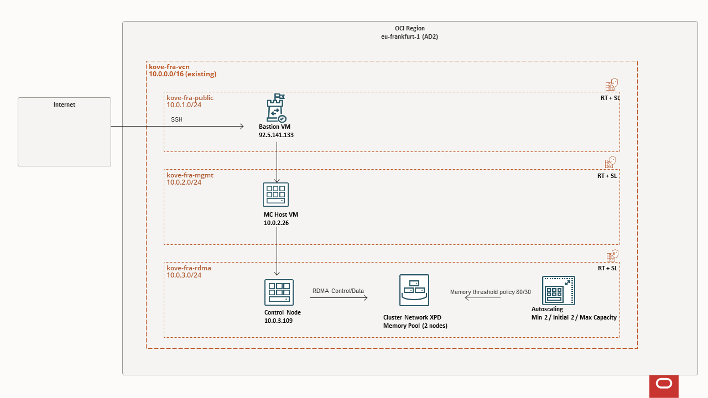

# oci-kove-terraform

Terraform modules and stack wrappers for deploying a Kove RDMA shared-memory platform on Oracle Cloud Infrastructure (OCI).

## What this repo deploys

The RDMA platform deployment targets this topology:

- 1 RDMA controller node
- 2 memory nodes by default (`memory_node_count = 2`), with scale-out to `n+1`
- Optional bastion VM in a public subnet
- 1 management controller VM in a private subnet
- Dedicated RDMA private subnet for bare metal nodes

Management and bastion shapes can be configured as flex VMs, and custom image OCIDs are supported for both. Bare metal nodes use a required custom image (`bm_node_image_ocid`).

## Deployment options

| Option | Path | Notes |
|---|---|---|
| Networking only | `modules/networking` | Creates VCN, subnets, routes, gateways, and security lists only. |
| Full RDMA platform | Root module (`main.tf`) using `modules/xpd-cluster` | Deploys bastion (optional), management VM, and RDMA nodes. |
| OKE deployment | `modules/oke` | Cloud-native OKE cluster path, separate from bare-metal RDMA node deployment. |

## RDMA deployment modes

In `modules/xpd-cluster` and the root deployment module:

- `rdma_deployment_mode = "compute_cluster"` (default)
  - Creates a compute cluster.
  - Creates 1 control BM plus `memory_node_count` memory BMs.
- `rdma_deployment_mode = "cluster_network"`
  - Creates 1 dedicated control BM.
  - Creates a cluster network memory pool sized by `memory_node_count`.

## Autoscaling behavior

The RDMA stack supports OCI autoscaling configuration in `cluster_network` mode through module inputs (min/max/threshold/cooldown settings).

## Cloud-init behavior

Cloud-init templates in `modules/xpd-cluster/cloud_init` are used to:

- bootstrap SSH access on RHEL images
- optionally register RHSM credentials
- install RDMA packages and configure OCI RDMA plugins

## Repository layout

| Path | Purpose |
|---|---|
| `modules/` | Reusable Terraform modules (`labels`, `networking`, `oke`, `xpd-cluster`, `mc-instance`). |
| `docs/` | Internal project documents such as QA tracking logs. |

## Quick start

## Frankfurt prod xpd-cluster MC reference plan



### Full RDMA stack

1. Open `terraform.tfvars.example`.
2. Copy to `terraform.tfvars` and set required values.
3. Deploy:

```powershell
terraform init
terraform plan
terraform apply
```

## Requirements

- Terraform >= 1.3
- OCI provider >= 5.0

## License

Use the license policy defined by your organization or parent project.